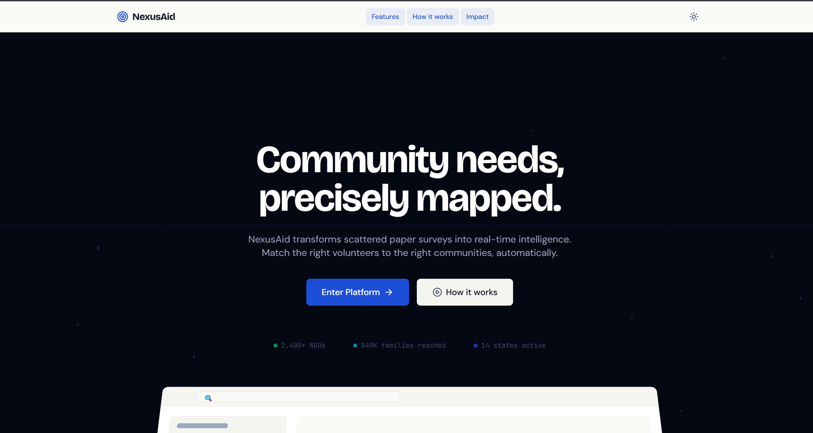

# 🌍 NexusAid: Smart NGO Matcher Platform

   

<div align="center">
  <br />
  <a href="https://smart-ngo-matcher.vercel.app/" target="_blank">
    
  </a>
  <br />
  <br />
  <b>🚀 <a href="https://smart-ngo-matcher.vercel.app/" target="_blank">Click here or on the image above to view the Live Deployment</a></b>
  <br />
  <br />
</div>

**NexusAid** is a next-generation platform designed to revolutionize how Non-Governmental Organizations (NGOs) and disaster response teams manage ground operations. By intelligently bridging the gap between field incidents and available volunteer skills, NexusAid ensures rapid, coordinated, and transparent disaster relief.

---

## 🎯 Core Features

### 🏢 1. Coordinator Command Center
The administrative brain of the operation, designed for NGO staff to monitor and direct aid effectively:
* **Interactive Heat Map:** Visualize crisis zones globally using dynamic Leaflet integration. See where help is needed most urgently.
* **Smart Volunteer Matcher:** AI-inspired matching algorithm that pairs specific field problems (e.g., medical aid) with the most qualified volunteers based on skill relevance, historical rating, and geographical distance.
* **Incident Reports & Analytics:** Comprehensive data visualization for tracking ongoing missions, solved problems, and overall NGO impact.

### 🏃‍♂️ 2. Dedicated Volunteer Portal
A mobile-first, highly responsive application interface tailored specifically for field workers:
* **Task Assignments:** Volunteers receive tailored tasks with precise geographical coordinates and mission briefs.
* **Field SOS Button:** A built-in panic button that instantly broadcasts the volunteer's live location to the Coordinator Dashboard during emergencies.
* **Proof of Completion Hub:** An intuitive drag-and-drop / camera-integrated interface for uploading Before and After mission photos.
* **Gamification:** Seamless task feedback loops that prepare volunteers for badge tracking and performance scoring.

### 🔐 3. Intelligent Architecture & Auth
* **Role-Based Workflows:** Distinct, secure routing separating Coordinators (`/dashboard`) from Volunteers (`/volunteer/dashboard`).
* **Animated Secure Login:** Features an interactive "Nexus Mascot" that reacts dynamically to password inputs for an engaging user experience.
* **Theme Engine:** Built-in seamless dark/light mode toggling utilizing premium CSS variables.

---

## 🛠️ Technology Stack

* **Frontend:** React.js, React Router DOM v7
* **Styling:** Tailwind CSS, Framer Motion (for fluid micro-animations)
* **Mapping:** Leaflet & React-Leaflet
* **Backend & Database:** Supabase (PostgreSQL with Row Level Security)
* **Icons:** Lucide React

---

## 🚀 Quick Start Guide

### Prerequisites
* Node.js (v18 or higher)
* A [Supabase](https://supabase.com/) account and project.

### 1. Installation
Clone the repository and install the necessary dependencies:
```bash
git clone https://github.com/Karthikeyancse-coder/smart-ngo-matcher.git
cd smart-ngo-matcher/ngo-resource
npm install
```

### 2. Environment Setup
Create a `.env.local` file in the root directory and add your Supabase credentials:
```env
REACT_APP_SUPABASE_URL=your_supabase_project_url
REACT_APP_SUPABASE_ANON_KEY=your_supabase_anon_key
```

### 3. Database Migration
Run the included SQL schema in your Supabase SQL Editor to set up the required tables and security policies:
1. Open the Supabase Dashboard.
2. Navigate to the **SQL Editor**.
3. Copy and paste the contents of `supabase_schema.sql` and run it.

### 4. Running the Application
Start the local development server:
```bash
npm start
```
The application will be available at `http://localhost:3000`.

---

## 📸 Platform Previews

* **Dual Login Flow:** Easily switch between Coordinator and Volunteer authentication.
* **Task Map & Directions:** Real-time distance and estimated time calculation for field tasks.
* **Interactive Proof Uploads:** "Dropzone" style camera capture for verifying mission success.

---

## ☁️ Deployment (Vercel)
This project is fully optimized for Vercel deployment. You can view the active production build here:
👉 **[NexusAid Live Deployment](https://smart-ngo-matcher.vercel.app/)**

If you wish to deploy your own instance:
1. Connect your GitHub repository to Vercel.
2. Override the Build Command to `CI=false npm run build` to bypass strict unused-variable linting.
3. Add the `REACT_APP_SUPABASE_URL` and `REACT_APP_SUPABASE_ANON_KEY` as Environment Variables in the Vercel dashboard.
4. Deploy!

---
*Built with ❤️ to optimize global relief efforts.*
